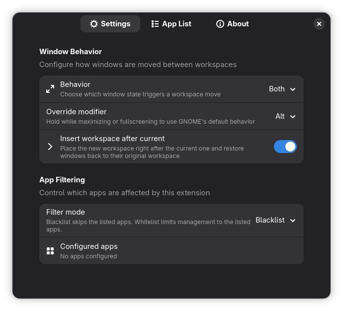
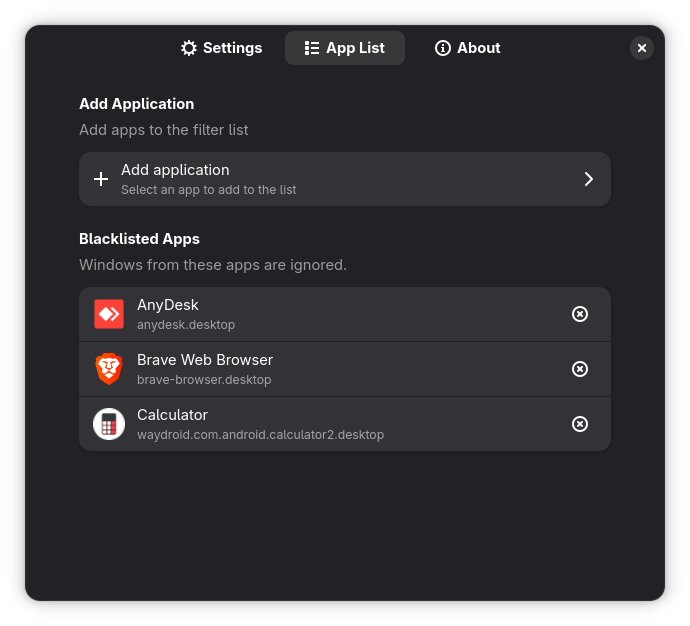
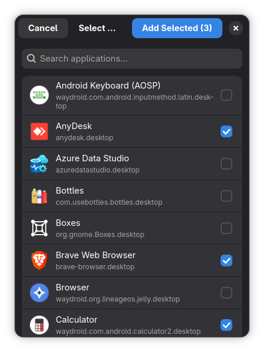
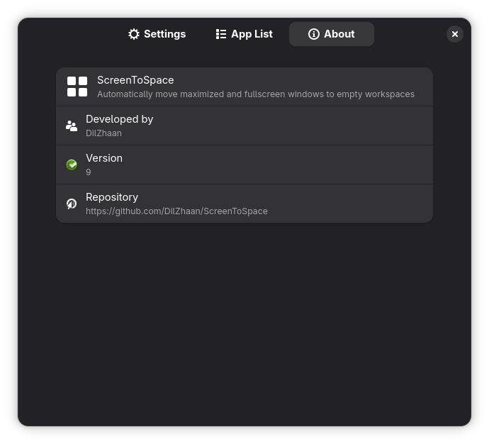

# ScreenToSpace

A GNOME Shell extension that automatically moves maximized and fullscreen windows to empty workspaces, keeping your workflow organized without manual intervention. Includes per-application filtering and multi-monitor support.

[](https://www.gnu.org/licenses/old-licenses/gpl-2.0.en.html)
[](https://www.gnome.org/)

---

## Features

### Core Functionality
- **Automatic workspace isolation** — Maximized and fullscreen windows move to empty workspaces, one window per space
- **Configurable trigger behavior** — Choose whether maximize, fullscreen, or both trigger workspace isolation via dropdown selector
- **Override modifier key** — Hold Alt/Super/Ctrl/Shift while maximizing/fullscreening to bypass ScreenToSpace and use GNOME's default behavior
- **Flexible workspace placement** — Insert new workspace after current (with restore to original) or use the last empty workspace
- **Smart workspace reordering** — Minimized disruption to existing window layout when creating or destroying isolated workspaces
- **Focus preservation** — Moved/restored windows automatically gain focus and raise to prevent being hidden behind other windows
- **Multi-monitor aware** — Respects GNOME's "workspaces on primary display only" setting; handles per-monitor workspace assignment correctly

### Application Filtering
- **Blacklist mode** (default) — Exclude specific apps from automatic workspace management (e.g., Telegram, WhatsApp, Brave)
- **Whitelist mode** — Only manage explicitly listed apps; all others remain in their current workspace
- **Multi-select app chooser** — Select multiple applications at once with search and checkbox UI
- **Per-app granularity** — Filter by desktop app ID with automatic normalization (strips `.desktop` suffix for matching)

---

## Screenshots

### Settings Tab
Configure window behavior and filter mode:



### App List Management
View and manage blacklisted/whitelisted applications:



### Multi-Select App Chooser
Select multiple apps at once with search:



### About
Extension information and version details:



---

## Requirements

- GNOME Shell 49
- Standard GNOME Shell extension runtime (no additional dependencies)

---

## Installation

### From source (development or manual install)

```bash
git clone https://github.com/DilZhaan/ScreenToSpace.git
cd ScreenToSpace
```

**Compile schemas and install:**
```bash
glib-compile-schemas src/schemas
mkdir -p ~/.local/share/gnome-shell/extensions/screentospace@dilzhan.dev
rsync -av --delete src/ ~/.local/share/gnome-shell/extensions/screentospace@dilzhan.dev/
```

**Enable the extension:**
```bash
gnome-extensions enable screentospace@dilzhan.dev
```

**Restart GNOME Shell:**
- X11: `Alt+F2`, type `r`, press Enter
- Wayland: Log out and back in

### From ZIP archive

```bash
./scripts/makezip.sh
gnome-extensions install build/screentospace@dilzhan.dev.zip --force
gnome-extensions enable screentospace@dilzhan.dev
```

---

## Configuration

Open preferences via GNOME Extensions app or:
```bash
gnome-extensions prefs screentospace@dilzhan.dev
```

### Settings Tab

**Window Behavior**
- *Behavior* — Dropdown to choose trigger mode:
  - **Maximized** — Only maximized windows trigger workspace isolation
  - **Full Screen** — Only fullscreen windows trigger workspace isolation
  - **Both** (default) — Both maximized and fullscreen windows trigger workspace isolation
- *Override modifier* — Choose a modifier key (None/Alt/Super/Ctrl/Shift) that, when held during maximize/fullscreen, bypasses ScreenToSpace and uses GNOME's default behavior
- *Insert workspace after current* — When enabled, places the new workspace immediately after the current one (instead of at the end) and restores windows back to their exact original workspace. When disabled, uses the last empty workspace with smart reordering

**App Filtering**
- *Filter mode* — Choose **Blacklist** (ignore listed apps) or **Whitelist** (manage only listed apps)
- *Configured apps* — Shows current app count; click through to App List tab to manage

### App List Tab

**Add Application** (top section)
- Opens multi-select dialog with search bar
- Filter by app name or desktop ID
- Select multiple apps with checkboxes; click "Add Selected (N)" to confirm

**Blacklisted/Whitelisted Apps** (bottom section)
- Shows app icon, name, and desktop ID for each entry
- Remove button (circular trash icon) per app
- Empty state prompts to add apps using button above

### About Tab

Extension metadata: name, author, version, repository link

---

## How It Works

### Window lifecycle

**Placement (window enters maximized/fullscreen state):**
1. Extension detects size-change signal from window manager
2. Check if override modifier is pressed; if so, bypass ScreenToSpace (GNOME default behavior)
3. `WindowFilter` checks if window qualifies: normal window type, matches app filter rules, matches configured trigger behavior (maximize/fullscreen/both)
4. `WorkspaceManager` scans for empty workspace on the same monitor
5. `WindowPlacementHandler` places window using configured mode:
   - **Insert after current mode**: Takes the last completely empty workspace, reorders it to position after current workspace, moves only the isolated window there, stores reference to original workspace
   - **Reorder mode** (default): Swaps empty workspace with current workspace, other windows stay in place, stores reference to home workspace
6. Window is explicitly focused and raised to ensure visibility

**Return (window exits maximized/fullscreen state):**
1. Extension detects size-change signal indicating unmaximize/unfullscreen
2. Retrieve stored workspace reference (original/home workspace)
3. `WindowPlacementHandler` restores window using identity-based lookup:
   - If the stored workspace still exists (verified by object identity), move window back to it
   - If the workspace was removed (dynamic workspaces), fall back to existing restore heuristic (last occupied / nearest workspace)
4. Window is explicitly focused and raised to prevent being hidden behind other windows
5. Workspace is activated so user follows the restored window

### App filtering details

- App IDs are normalized: lowercased, `.desktop` suffix stripped
- Window IDs resolved via `get_gtk_application_id()`, `get_wm_class_instance()`, or `get_wm_class()` (first non-null match)
- **Blacklist mode**: If app ID is in blacklist, skip workspace isolation (window stays in current workspace regardless of maximize/fullscreen)
- **Whitelist mode**: If whitelist is non-empty, only manage windows whose app ID is in the whitelist; all others are ignored
- Empty whitelist in whitelist mode = manage nothing (explicit opt-in required)

### Multi-monitor behavior

Respects GNOME's "Workspaces on primary display only" setting:
- **Primary-only mode**: Only the primary monitor's workspace changes trigger isolation; other monitors' windows are left alone
- **All-monitors mode**: Each monitor has independent workspace stacks; extension manages workspaces per-monitor (checks `window.get_monitor()` and only scans workspaces for windows on that monitor)

---

## Architecture

Modular design following Single Responsibility Principle:

```
src/
├── extension.js          # Entry point, signal wiring, lifecycle
├── constants.js          # Centralized string literals and settings keys
├── eventHandler.js       # Window manager signal dispatcher
├── windowFilter.js       # Eligibility predicate (window type, app filter, state checks)
├── windowPlacement.js    # Workspace reorder logic, window movement
├── workspaceManager.js   # Workspace queries (find empty, find occupied)
├── prefs.js              # Preferences UI (Adw, three-tab layout)
└── schemas/
    └── org.gnome.shell.extensions.screentospace.gschema.xml
```

**Key modules:**
- `WindowFilter` — `isManagedWindow(window)` combines type check + app filter logic; `shouldPlaceOnSizeChange(window, change)` checks maximize/fullscreen triggers independently; app ID normalization and blacklist/whitelist evaluation happen here
- `WindowPlacementHandler` — `placeWindowOnWorkspace(window)`, `returnWindowToOldWorkspace(window)` encapsulate workspace operations; supports both reorder mode and insert-after-current mode; stores workspace references for identity-based restore; handles focus/raise after moves
- `WorkspaceManager` — `getFirstFreeWorkspace(manager, monitor)`, `getLastOccupiedWorkspace(manager, currentIndex, monitor)`, `getLastCompletelyEmptyWorkspace(manager)` abstract workspace discovery
- `WindowEventHandler` — Bridges window manager signals (`map`, `size-change`, `minimize`, etc.) to placement/filter logic; checks override modifier state; tracks pending actions between `size-change` and `size-changed` signals

---

## Troubleshooting

### Extension not loading

```bash
# Check status
gnome-extensions info screentospace@dilzhan.dev

# View logs
journalctl -f -o cat /usr/bin/gnome-shell | grep -i screentospace

# Reset settings
dconf reset -f /org/gnome/shell/extensions/screentospace/
```

### Schema errors after update

```bash
# Recompile schemas in installed extension
glib-compile-schemas ~/.local/share/gnome-shell/extensions/screentospace@dilzhan.dev/schemas/

# Restart GNOME Shell (X11: Alt+F2, r; Wayland: relog)
```

### Windows not moving

1. Verify extension is enabled: `gnome-extensions list | grep screentospace`
2. Check "Behavior" dropdown is set correctly (not disabled for the window state you're testing)
3. Ensure you're not holding the override modifier key while maximizing/fullscreening
4. If using whitelist mode, ensure target app is in the whitelist
5. Confirm GNOME dynamic workspaces are enabled (Settings → Multitasking → Workspaces)

### App not appearing in blacklist/whitelist

- The extension matches against desktop app IDs (e.g., `org.telegram.desktop`, `brave-browser`)
- IDs are normalized (lowercased, `.desktop` stripped)
- If an app doesn't have a desktop ID, it may not be filterable
- Check app's actual ID: `Gio.DesktopAppInfo.new('app-name.desktop').get_id()` in Looking Glass (`Alt+F2`, `lg`)

---

## Development

### Build from source

```bash
git clone https://github.com/DilZhaan/ScreenToSpace.git
cd ScreenToSpace

# Compile schemas
glib-compile-schemas src/schemas

# Build zip
./scripts/makezip.sh
# Output: build/screentospace@dilzhan.dev.zip
```

### Local testing

```bash
# Deploy to local extensions directory
rsync -av --delete src/ ~/.local/share/gnome-shell/extensions/screentospace@dilzhan.dev/
glib-compile-schemas ~/.local/share/gnome-shell/extensions/screentospace@dilzhan.dev/schemas/

# Restart GNOME Shell (X11)
# Alt+F2, r

# Watch logs
journalctl -f -o cat /usr/bin/gnome-shell
```

### Code style

- ES modules (`import`/`export`)
- 4-space indentation
- JSDoc for public methods
- Descriptive variable names (`currentWorkspace`, not `ws`)
- No abbreviations in identifiers except standard ones (`appId`, `wm`)

### Structure notes

- All window manager signals wired in `extension.js:_connectSignals()`
- Settings keys defined in `constants.js` to avoid typos
- App filtering entirely contained in `windowFilter.js:_isAppAllowed()`
- Preferences UI uses Adw (libadwaita widgets); three-page layout with `Adw.PreferencesPage` instances

---

## License

GPL-2.0-or-later

```
Copyright (C) 2025 DilZhaan

This program is free software; you can redistribute it and/or modify
it under the terms of the GNU General Public License as published by
the Free Software Foundation; either version 2 of the License, or
(at your option) any later version.

This program is distributed in the hope that it will be useful,
but WITHOUT ANY WARRANTY; without even the implied warranty of
MERCHANTABILITY or FITNESS FOR A PARTICULAR PURPOSE.  See the
GNU General Public License for more details.
```

Full license text: [LICENSE](LICENSE)

---

## Author

DilZhaan  
GitHub: [@DilZhaan](https://github.com/DilZhaan)  
Repository: [github.com/DilZhaan/ScreenToSpace](https://github.com/DilZhaan/ScreenToSpace)  
Support: [buymeacoffee.com/dilzhan](https://buymeacoffee.com/dilzhan)

---

## Changelog

**v9** (2025-12-28)
- **Behavior dropdown**: Configure maximize/fullscreen triggers independently (Maximized, Full Screen, or Both)
- **Override modifier**: Hold Alt/Super/Ctrl/Shift while maximizing/fullscreening to bypass ScreenToSpace
- **Insert workspace after current**: Optional mode to place new workspace right after current (with restore to exact original workspace)
- **Unified restore behavior**: Always returns to original workspace if it exists, with fallback to last occupied/nearest
- **Focus preservation**: Moved/restored windows are explicitly focused and raised to prevent being hidden
- **Identity-based workspace tracking**: Robust handling of dynamic workspace removal
- **One-time settings migration**: Automatic upgrade from legacy single toggle to new separate triggers

**v8** (2025-12-24)
- Added per-application blacklist/whitelist filtering
- Multi-select app chooser with search functionality
- Redesigned preferences UI (three-tab layout)
- App ID normalization for reliable matching
- Configurable filter mode (blacklist/whitelist toggle)

**v7** (Previous)
- Initial public release
- Core workspace isolation functionality
- Multi-monitor support
- Maximize/fullscreen window handling

---

**Note:** This extension is developed and tested on Fedora/RHEL-based systems running GNOME Shell 49. Community contributions and bug reports welcome.

